## notice  
1. 做好镜像管理、数据管理和记录，记得version ctrl和备份   
2. 

## code explaination 
- 用datalist（存储样本文件地址的list）来维护数据集
- 测试2d 2d多通道 3d vit  
- 该implement是将同一层的od os进行水平concat  

## env
```
docker run -p 49440:22 -it --rm -d --ipc host  --gpus 1  --mount type=bind,source=/media/oct,target=/code  chen
```
```
ssh -p 17639 chen@3.26.210.83
```
## log
### 1
- 完成了datalist方式维护数据加载列表
func（create datalist）写在了train.py，之后挪到utilize中
### 2
- od os 水平concate
- 写了balance（aug） func，之后挪到utilize中
- 2d vit/2.5d vit  不work,能正常跑通，但net学不到特征
- 之后尝试使用别的数据集
### 3 2024.2.18
- 引入一个新的数据集进行测试（datasets/paultimothymooney/），oct的4分类task
- 整理一下代码，做一下注释
- oct4class在ce上很不稳定，换成bce with logits
- 448 bce bs=64 depth=16 heads=10 adam (bce_oct4_class.pt)
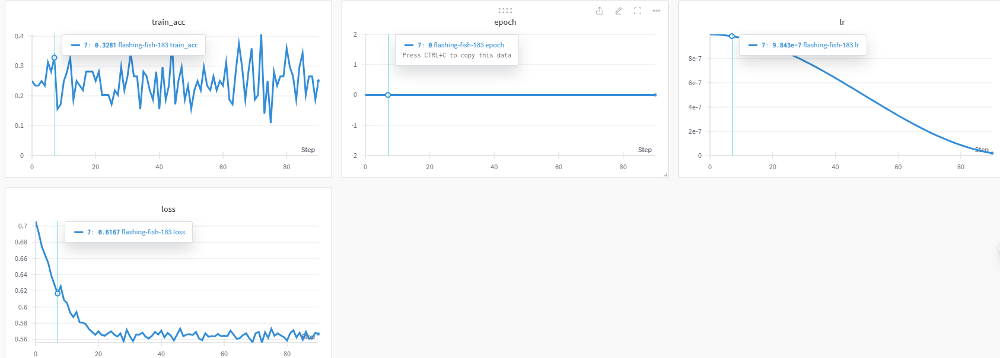
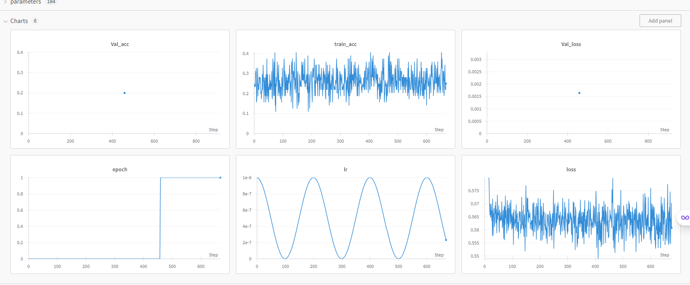
- model换成vgg16， 也不理想
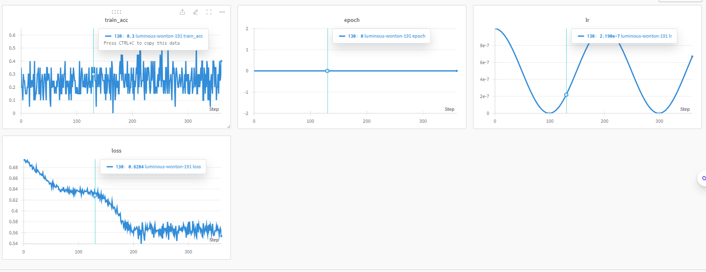
- load covid的预训练试一试  
TODO: 加载失败，先改成strict false 跑一下试试看  
能work a bit, loss稍微有些改善(work_oct4class_epoch14.pt, 继续收敛，已删除) rmk: val精度波动比较大，写一下网络保存策略（val acc），然后增加一下bs，稍微降一点lr继续跑
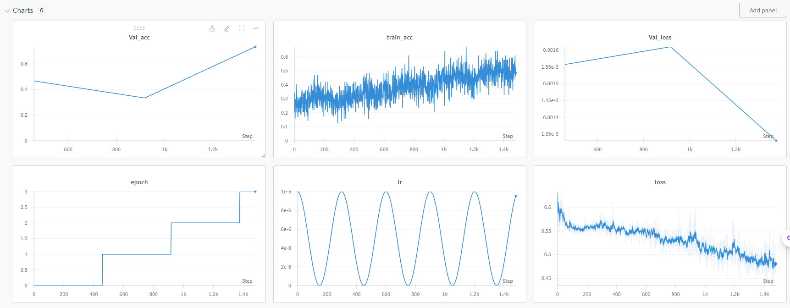
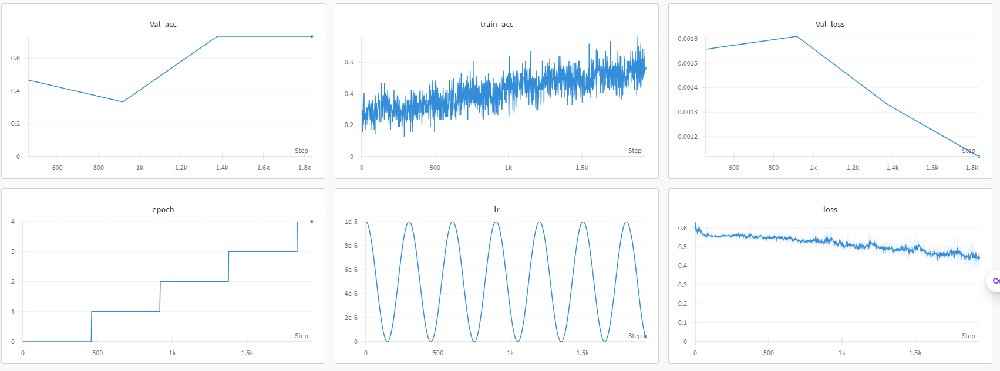
Next:
- 想办法解决load问题
- 学习一下torch的权重修改
- oct4class跑到90的acc，再去做octa task
- 学习一下[pretrain](https://www.analyticsvidhya.com/blog/2020/08/top-4-pre-trained-models-for-image-classification-with-python-code/)
- 学习一下[Train a Vision Transformer on small datasets](https://keras.io/examples/vision/vit_small_ds/)
- load covid-vit 2d/3d 在oct上，看能否work然后发一下结果
- 记得修改一下val的间隔
- 标化记录一下实验结果
# 4 2024.2.19
- vgg加载pretrain之后的效果很不错（下一步规范下代码）(存了一个接近收敛的版本，work_oct4class_vgg.pt)
oct4class_vgg_1 log
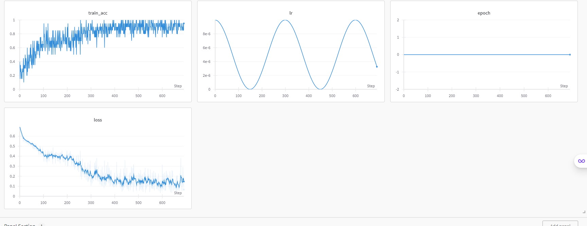
- vit收敛速度太慢（比vgg差很多），bs还可以继续加，总之先试图跑到收敛（搞定，后续测试Resnet2d以及3d）
- 如果当前收敛完效果不如vgg的话，vit加载一个google的预训练（也是224）然后进行训练
- 目前vit还有收敛趋势（oct4class_1 -> 2），lr貌似太大，减半接着跑，感觉bs可能太大影响收敛，试一下小bs  
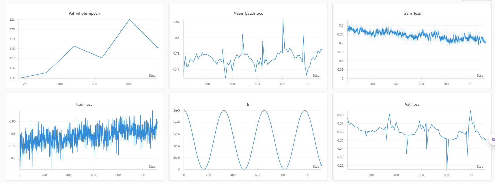
减小bs没用，再改回去
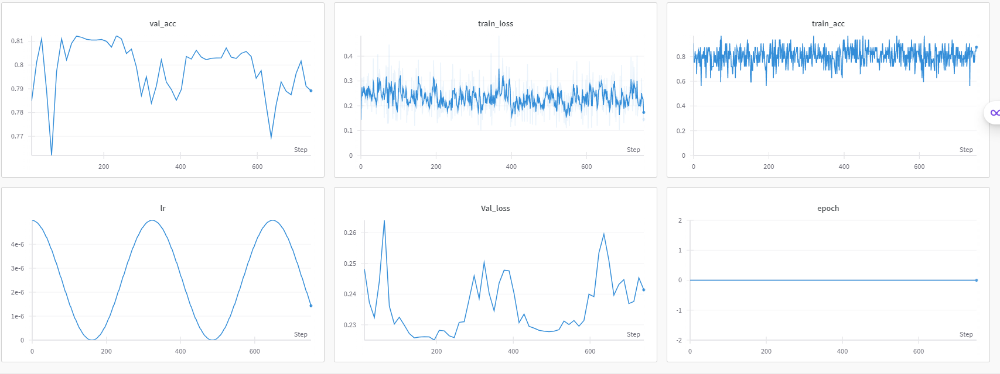
- 想试一下大的lr看下效果（1e4），保存在oct4class_biglr
- TODO: 用一个字典来配置模型的训练设置
- lr大了之后效果很好，收敛更快，并且效果更好
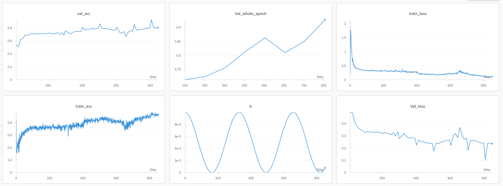
和5e-6比较
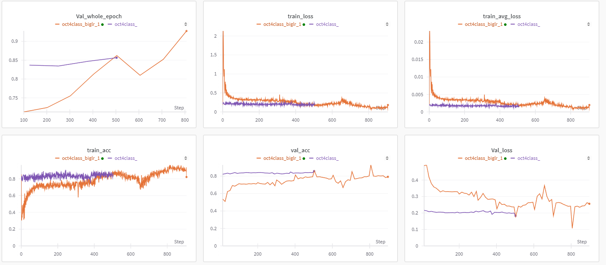
基本收敛了，save 在oct4_class_biglr, val_acc=0.96  
- 尝试用上面这个来训练一下octa data  
    - 把三通道改成os、od、os
    - transform修改一下(260 crop to 224)
    - 固定切片选取高度（20），之后修改成随机也跑一下
好像有点苗头，增加一个神经元用来回归输出，然后0.5*bce + 0.5*mse
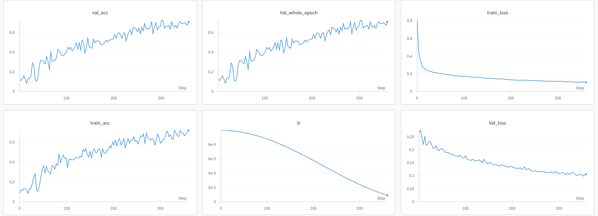
- 非常有效， xg pretrain, lr=1e-4 ,bs=256, check有污染
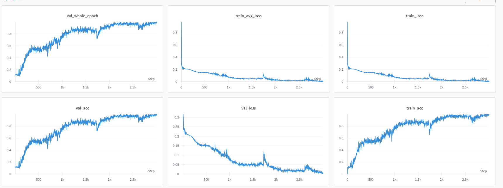


# 5 2024.2.23  
- 把sat_avg改成四分类  
- 然后新的dataset
- TODO: dataset改成4分类后，label变成了 [onehot，reg——value]， 下次纯reg也要更改末尾来匹配新的代码


# 6 2024.2.25
- 修改cosine annelaing，每个epoch进行衰减
- epoch many调整一下数量， val的bal关掉
- 先测试no balce
- 保存每个split保存3个